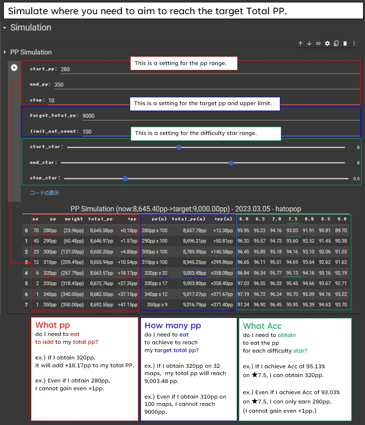

## MyPPSimulator_En

The [Google Colab Notebook](https://colab.research.google.com/github/hatopopvr/MyPPSimulator/blob/main/MyPPSimulator_En.ipynb)
 to simulate your [ScoreSaber](https://scoresaber.com/)'s total PP.

## how to use

1. When the [notebook](https://colab.research.google.com/github/hatopopvr/MyPPSimulator/blob/main/MyPPSimulator_En.ipynb)  opens, input information below.
 - `player_id` : enter the ScoreSaber PlayerID.

2. Press the `Runtime` tab, then Press the `Run All` or `Restart and Run All` button to get the results.  
  (Please run it despite the warning. )

3. This tool saved  data on Google Drive, so you'll need to do a Google Authentication with your account.  
  (saved data: songs data, score data, etc.)

### Simulator Overview.

### ScatterPlot Overview.

<b>Data</b>
- Score Data from ScoreSaber Public API - [doc](https://docs.scoresaber.com/)  
- Ranked Map Data from RankedMapData by rakkyo150 - [RankedMapData](https://github.com/rakkyo150/RankedMapData)  

<b>Author</b>
- hatopop ([@hatopop_vr](https://twitter.com/hatopop_vr))

<b>Caution</b>
- If you would like me to add a default value for the timezone, please mentions me on Twitter.
